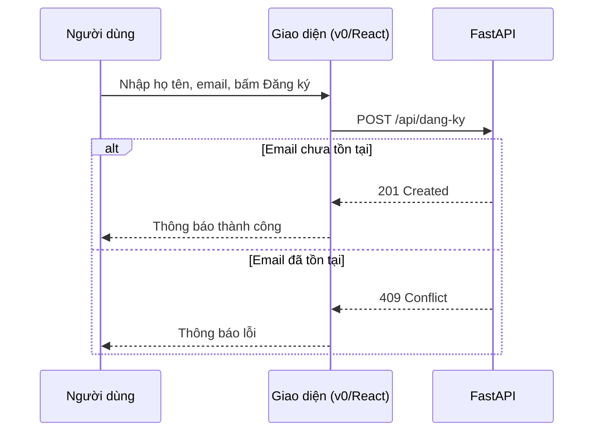

# Sơ đồ luồng đăng ký

```mermaid
sequenceDiagram
    participant U as Người dùng
    participant UI as Giao diện (v0/React)
    participant API as FastAPI

    U->>UI: Nhập họ tên, email, bấm Đăng ký
    UI->>API: POST /api/dang-ky
    alt Email chưa tồn tại
        API-->>UI: 201 Created
        UI-->>U: Thông báo thành công
    else Email đã tồn tại
        API-->>UI: 409 Conflict
        UI-->>U: Thông báo lỗi
    end
```
